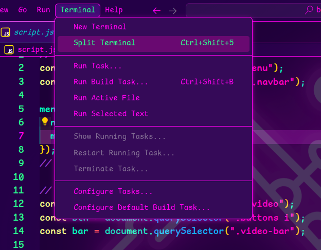
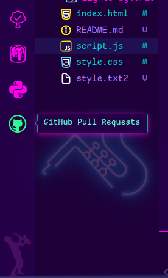

# **Sax Synth Color Theme for VS Code**

## Table of Contents
- [**Sax Synth Color Theme for VS Code**](#sax-synth-color-theme-for-vs-code)
  - [Table of Contents](#table-of-contents)
  - [Introduction](#introduction)
- [Features](#features)
    - [Existing Features](#existing-features)
  - [FEATURE 1](#feature-1)
      - [FEATURE 2](#feature-2)
      - [FEATURE 3](#feature-3)
    - [Features Left to Implement](#features-left-to-implement)
  - [Technologies Used](#technologies-used)

## Introduction

A synthwave inspired color theme for VS Code for Sax Players or anyone else who loves neon. 

# Features

### Existing Features

## Background Image

* Download the background image from this repo. 
* Download the VS Code extension by KatsuteDev [Background](https://github.com/KatsuteDev/Background)
* Follow the instructions provided by KatesuteDev in the README.md.

## Color Highlighting

* Green Highlighting on all text in VS Code with the exception of Code. 
  
### Menu Highlighting

### Icon Highlighting

### Features Left to Implement

* Feature additional horns/instruments. 

## Technologies Used

### Frameworks, Libraries & Programs Used

* [Theme Studio for VS Code](https://themes.vscode.one/)
* [VSCE](https://github.com/microsoft/vscode-vsce)
* [MICROSOFT AZURE](https://azure.microsoft.com/)
* [MICROSOFT VISUAL STUDIO CODE](https://code.visualstudio.com/)

### Forking the GitHub Repository

The following steps can be used to fork the GitHub repository:
* On GitHub navigate to the main page of the repository.
* The 'Fork' button can be found on the top righthand side of the screen.
* Click the button to create a copy of the original repository.

### Cloning the GitHub Repository

The following steps can be used to clone the GitHub repository:
* On GitHub navigate to the main page of the repository.
* Above the list of files select 'Code'.
* Three options are provided, HTTPS, SSH and GitHub CLI. Select the appropriate option and click the 'Copy' button next to the URL.
* Open Git Bash.
* Change the working directory to the location for the cloned directory.
* Type git clone and paste the copied URL.
* Press 'Enter' to create the clone.

## Credits
* Theme Studio for VS Code was used to create the theme [Theme Studio for VS Code](https://themes.vscode.one/)
* VS Code Color Theme based on [synthwave80s-theme](https://github.com/Sanchodelniglo/synthwave80s-theme)
* Idea for incorperating a background image came from [practical-synth](https://github.com/Valx01P/practical-synth)
* Background Image made possible by VS Code extension [Background](https://github.com/KatsuteDev/Background)
* Background Image [Canva](https://www.canva.com/)

### Content
* Credit and sites we have taken information from
* Explanation [Visual Studio Code: Publishing Extensions](https://code.visualstudio.com/api/working-with-extensions/publishing-extension)
* Explanation [Visual Studio Code: Extension Manifest](https://code.visualstudio.com/api/references/extension-manifest#approved-badges)

